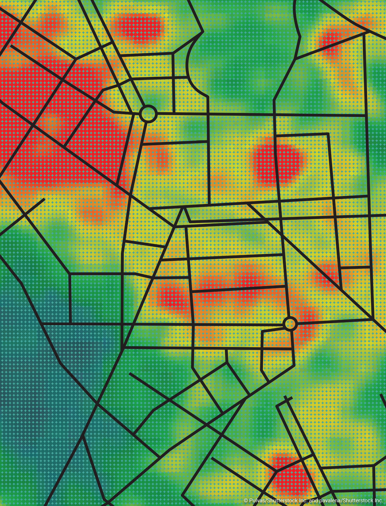

# Crime Pattern Analysis
Crime Pattern Analysis using Machine Learning whilst following CRISP-DM
This team project explores crime data through preprocessing, visualization, classification, and unsupervised learning techniques to uncover trends and anomalies.

---

## Project Workflow

- **Data Preprocessing**  
  - Cleaning, Mapping, Binning, Outlier removal
  - One-hot encoding
  
- **Class Distribution Handling**  
  - Manual undersampling to balance class labels
  
- **Visualization**  
  - Class imbalance, attribute relations, date-time effects
    
- **Modeling**  
  - K-Nearest Neighbors (KNN)
  - Decision Tree
  - K-Means Clustering
  - Outlier Detection using:
    - Isolation Forest (ISF)
    - Local Outlier Factor (LOF)
